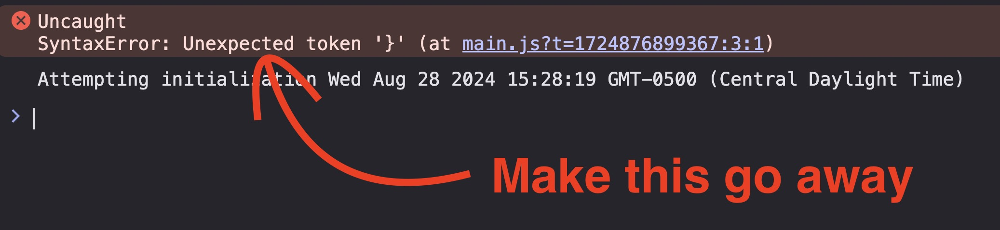
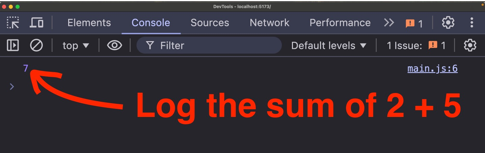

# Challenge 1: Fix the Syntax Error And Log a Custom Message to the Console

## Challenge Description
- In this challenge you'll need to fix the syntax error found in `/src/main.js` and then call the provided sum function to add 2 + 5.
- Finally you should console log the answer.

## Requirements
- Fix the syntax error in `/src/main.js`

- Call the provided sum function, adding 2 + 5
- Log the answer (7) to the browser console

- 💡 TIP: you could also call `alert()` and pass it the answer like this `alert(answer)`.
  - Alert used to be a useful for communicating feedback to users. 
  - Most web applications now use more nicely styled custom solutions but alert can still be useful for debugging just like console log.

